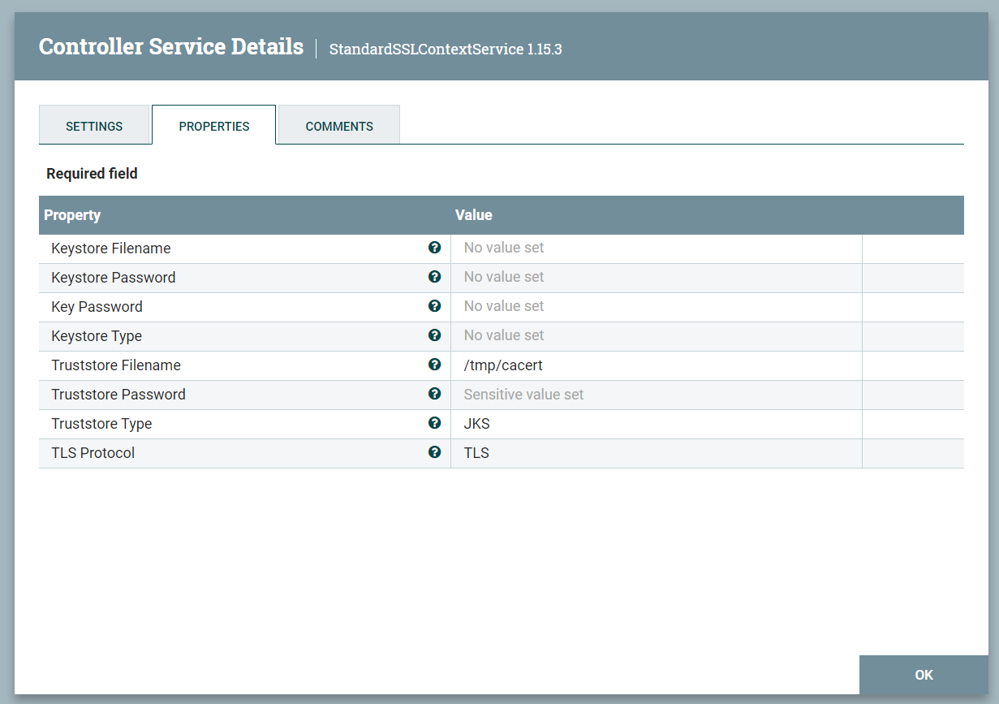

## Generating the JKS to enable SSL context from Apache NiFi

1. Gather the relevant certificates. These can be found in the secret elastic-es-http-certs-internal

2. Extract locally ca.crt, tls.crt (remove the ca.crt from the bundle) and tls.key

3. Generate a JKS using the following and set the password to changeit:

    ```bash
    pkcs12 -export -in tls.crt -out nifisslcontext -inkey tls.key -name nifi -CAfile ca.crt -caname elastic 
    ```

4. Make sure the store is working by running the following (password is changeit):

    ```bash
    keytool -v -list -keystore nifisslcontext  
    ```
5. The Java Keystore is now generated as a file called nifisslcontext.

6. Move the store to all nodes in the NiFi cluster:

    ```bash
    kubectl cp ./nifisslcontext nifi-demo-1-nodez2vp9:/tmp/cacert 
    kubectl cp ./nifisslcontext nifi-demo-2-nodevmdn9:/tmp/cacert 
    kubectl cp ./nifisslcontext nifi-demo-3-nodex9zlv:/tmp/cacert
    ```
7. Set up the SSL controller in NiFi. You only need to set the truststore part:

<p align="center">
 
 </p>