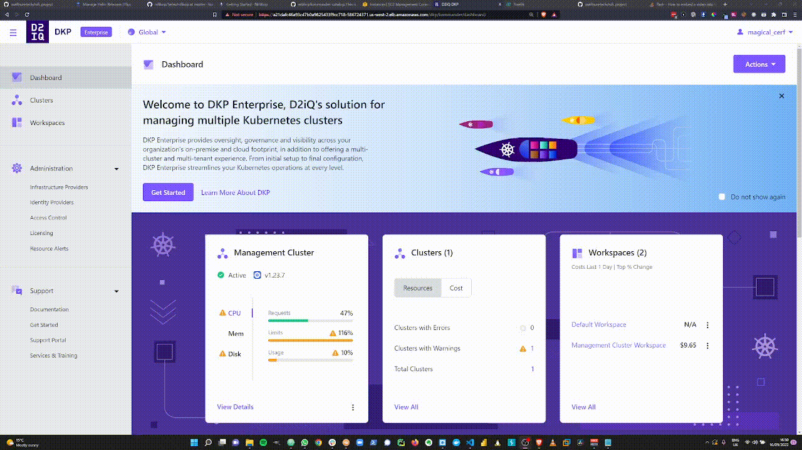

 
 # Apache NiFi in DKP

## Scope

The scope of the project is as follows:

- Generate a HELM chart that runs Apache NiFi with scaleable clusters
- Provide NiFe registry instance for flow version control and collaborative development
- Add the NiFi software as a catalogue item, deployable from the DKP UI
- Provide simple but meaningful configuration options to the end user
- Ensure the chart is available in an air-gapped deploy scenario

## Overview

There are a small number of existing HELM charts available through bitnami and artifact hub. These are traditional HELM charts that, with some configuration, will run on the DKP platform. However, none of the exiting iterations allow for a stable NiFi cluster experience and function as a single node only. This is not suitable for a production deployment owing to the lack of resilience.

There is an active project called NiFiKop, standing for NiFi Kubernetes Operator, which seeks to address these issues and provide a true NiFi experience tailored specifically for Kubernetes.

Rather than a helm chart consisting of a Stateful Set and peripheral services, it is an operator for NiFi. It generates a number of CRDs which allow the user to generate a cluster object, as well as advanced feature such as user and access management and dataflows.

The project is available [here](https://konpyutaika.github.io/nifikop/). It is open source, under active development but still in beta.

NiFi nodes run in pods that **are not** part of a stateful set. The reasons for this are to permit us to:
- Modify the configuration of unique Nodes
- Remove specific Nodes from clusters
- Use multiple Persistent Volumes for each Node

None of which are currently possible using a Stateful Set

The controller, utilising Zookeeper, manages the cluster functions for us to offer a bare metal type NiFi cluster experience.
## Pre-Requisites

- A healthy cluster managed by DKP. For demo purposes you can use the management cluster but as NiFi is very resource intensive, a dedicated cluster with adequate resources is required for production workloads
- kubectl installed on local machine

## Installation

- Clone this repo onto your local machine

    ```bash
    git clone https://github.com/swiftsuretech/nifi_project.git
    ```

- Set up a new project in DKP called "nifi" in a namespace with the same name:
<p align="center">
    
</p>

- Apply the manifests in the "nifi-deploy" directory to deploy the following Kubernetes objects:
    - Custom Resource Definitions for nifi objects
    - A working ingress controller
    - A repo defining our custom catalogue

    **Important** - Ensure you use "kubectl create" rather than "kubectl apply"!

    ```bash
    kubectl create -f ./nifi-deploy --recursive
    ```

- Go back to the DKP UI, you should see a new catalogue item appear in the applications tab

<p align="center">
    
</p>

- Click on "View Details" and the "Deploy". This will deploy the NiFi controller and 3 instances of Zookeeper as a stateful set. These objects will take a few minutes to deploy so go and make a cup of tea.

- Check that pods have deployed and are healthy.

    ```bash
    watch kubectl get po -n nifi
    ```
    
- Deploy the NiFi cluster

    The controller incorporates a number of Custom Resource Definitions. This allows us to generate a "NiFi Cluster" object. An example of a simple NiFi cluster manifest is in the "clusters" directory. It is strongly advised to deploy this cluster using the GitOps tab but for a quick start, apply the example manifest using kubectl:

    ```bash
    kubectl create -f clusters/nifi-cluster.yaml
    ```
- NiFi is a fairly heavyweight Java application. The pods will take a few minutes to come online.

    ```bash
    watch kubectl get po -n nifi
    ```
- Go to the NiFi UI

    The user interface endpoint is exposed through the Kommander Traefik ingress controller at the  "/nifi" endpoint. Duplicate the DKP UI url, replacing "/dkp/kommander/dashboard..." with "/nifi"


## Configuration


## Ingress


## Uninstallation


## Further Notes