# Running a big data stack on DKP

## Full Version

### Notes

- This is the detailed version. Field engineers and experienced DKP users wishing to use the tldr version should see [this guide](docs/catalog-deploy-tldr-version.md).
- In order to follow along with this tutorial, it is advised that you clone this repository to your local machine.
- A companion video is available for you to follow along:

[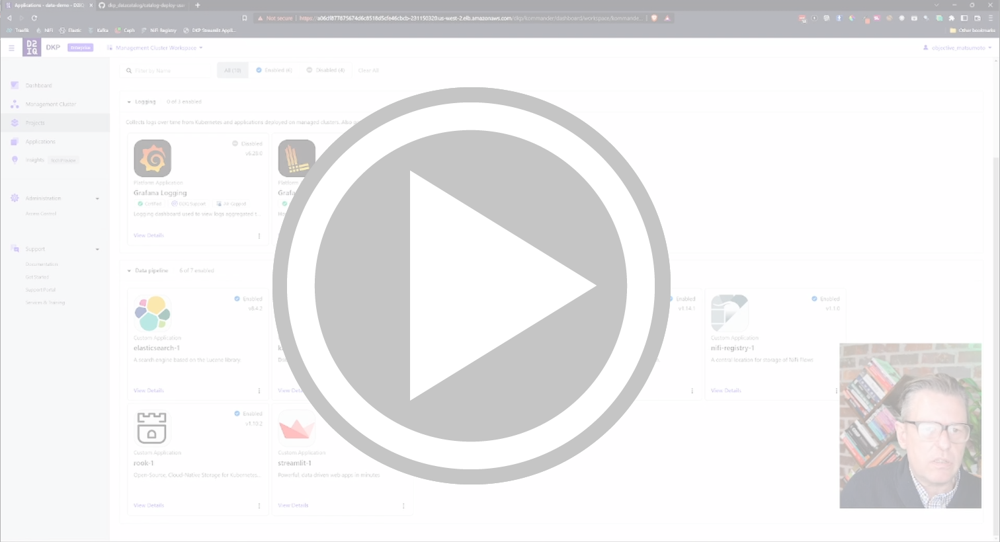](https://drive.google.com/file/d/1M01SVDnrJP2oImi2a0vzzj4DxdDqCC4e/view?usp=sharing)

### Pre-requisites

- A healthy DKP cluster, ver 2.0 or later.
- DKP User Interface Installed.
- Basic knowledge of Kubernetes.
- IF deploying a new cluster; suitable credentials to do so [(see here)](https://docs.d2iq.com/dkp/2.3/infrastructure-providers).
- kubectl and helm installed on your local machine.
- ***Important***: This demonstration uses ceph storage provided by Rook. Whilst our deployment will allow us to deploy a ceph cluster for the project, we need to have the controller pre-installed on the cluster. It is not appropriate to do this from a catalog application as the cleanup in particular is comples. With the operator in place, we will use the catalogue item to deploy individual ceph clusters and associated buckets and object stores later in the process. Run the following to check if the operator is already present:

    ```bash
    # Do a system wide check to see if our operator is present. 
    # If the operator pod is returned and shows healthy, we can move on.
    kubectl get po -n rook-ceph -l app=rook-ceph-operator
    ```
    If there is no ceph operator installed on the system, deploy it as follows:
    ```bash
    # Add the rook repo and install the operator
    helm repo add rook-release https://charts.rook.io/release
    helm repo update
    helm install --create-namespace --namespace rook-ceph rook-ceph rook-release/rook-ceph
    # Check the status of the operator. It may take a few minutes to come up
    watch kubectl get po -n rook-ceph -l app=rook-ceph-operator
    ```
### Scope

- The aim of the project is to deploy a fully functioning big data streaming stack into DKP that incorporates ingestion, processing, object storage, a document store and a front end application for analysis.
- This is an opinionated stack that uses, wherever possible, kubernetes "operators" to manage deployments. The examples shown are provided using a basic configuration and are therefore not production ready.  Operators allow the end user to configure their deployment with broadly the same options as bare metal deployments. It is advisable to review the latest documents pertaining to each of the product APIs for a production deployment.
- DKP provides users with the facility to create their own custom catalogue applications. Further details may be found in the [DKP documentation](https://docs.d2iq.com/dkp/2.3/custom-applications). This repository serves as an advanced example of that.

### Opinionated Technologies

- Links to the relevant operators can be found as follows:  
<br />
<center>

|Product|Type|Operator|Version|Link|
|---|---|---|---|---|
|Apache NiFi|Operator|nifNiFiKopikop|0.14.1|<a href="https://konpyutaika.github.io/nifikop/docs/1_concepts/1_start_here">NiFiKop</a>|
|Apache Kafka|Operator|koperator|0.21.2|<a href="https://github.com/banzaicloud/koperator">Koperator</a>|
|NiFi Registry|Helm Chart|dysnix|1.1.0|<a href="https://artifacthub.io/packages/helm/dysnix/nifi-registry">ArtifactHub</a>|
|Elasticsearch with Kibana|Operator|ECK|2.4.0|<a href="https://www.elastic.co/blog/introducing-elastic-cloud-on-kubernetes-the-elasticsearch-operator-and-beyond">Elastic ECK</a>|
|Rook Ceph Storage|Operator|Rook|1.10.0|<a href="https://rook.io/docs/rook/v1.10/Getting-Started/quickstart">Rook</a>|
|Streamlit|Helm Chart|Custom|0.1.0|<a href="https://streamlit.io/">Streamlit</a>|

</center>
<br />
The technology stack for this deployment is as follows:
<br/><br/>

<p align="center"> </p>

### Preparing the Environment

1. Ensure you have a healthy management cluster with the DKP user interface installed. Although it is possible to run the stack on the management cluster, it is highly advisable to create a new cluster specifically for this purpose. You may either add a cluster through the User Interface or attach an existing one.

2. NiFi is a heavyweight application written in Java. As such, it requires ample physical resources to function correctly. Worker nodes on the target cluster should meet the following requirements:
<br/><br/>

<center>

||Minimum|Recommended|
|---|:--:|:--:|
|Worker Nodes|4|8|
|CPUs|8|16|
|Memory|16Gi|32Gi|

</center>

### Configure a new workspace

1. Select "Workspace" from the sidebar menu and then "Create Workspace".

<p align="center">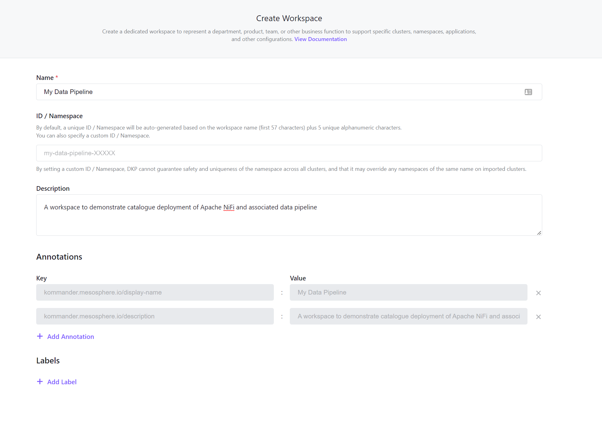</p>

2. Select the new workspace from the top menu.

### ***Optional***: Add a dedicated cluster

1. In the new workspace, select "Clusters" from the sidebar menu and select "Add Cluster". There are several ways to add a new cluster. For further information, see the DKP documentation [here]([link](https://docs.d2iq.com/)).

## Create a new project

1. From the "Projects" menu in the sidebar, create a new project:

- Name the project appropriately and ensure that you manually set the namespace from the default to the same as the project name (see highlighted diagram).
- Select the cluster you wish to deploy to. This would normally be a dedicated cluster but you may also use the DKP Management Cluster for demonstration purposes.
<p align="center">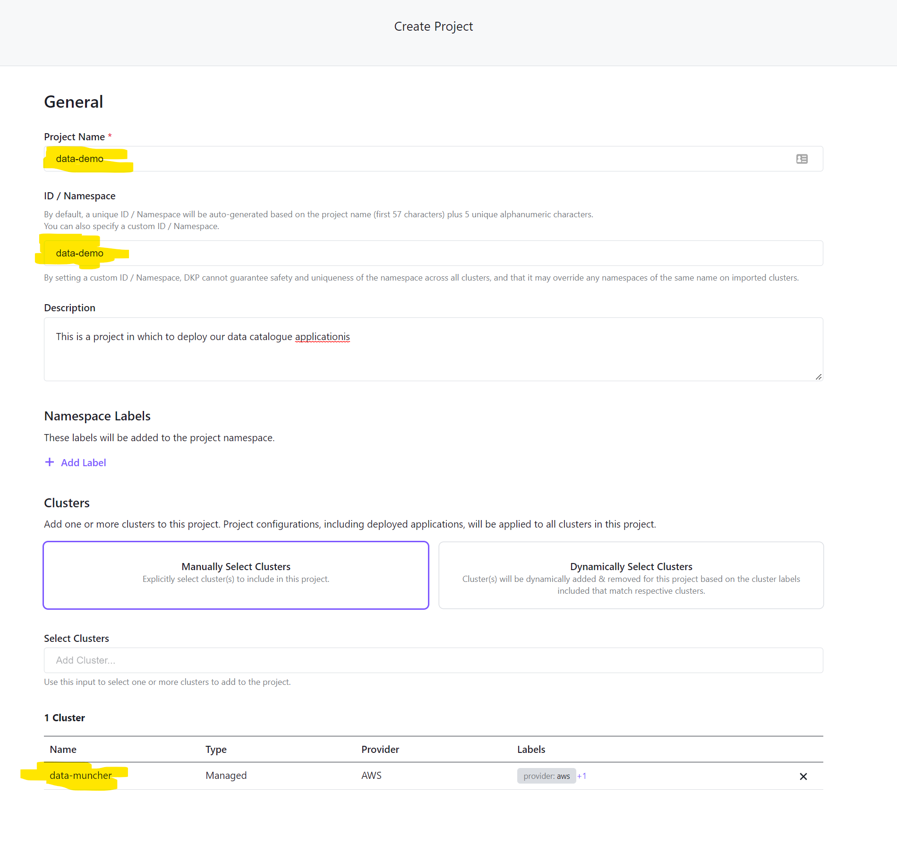</p>

  > ⚠️ To ensure that all your artifacts are deployed to the correct namespace, it is strongly advised to set kubeconfig context to your new namespace as follows:
    ```bash
    kubectl config set-context --current --namespace=data-demo 
    ```

## Deploy the catalogue

1. Ensure that you have cloned this repository to enable deployment of the HELM charts locally. Advanced users may use the registry version of this repo from Github.
2. Ensure that you deploy the registry to the correct namespace by following the step above or, alternatively, setting your namespace as an env variable:

    ```bash
    helm install catalog charts/data-catalog
    ```
3. Open your project to the "Applications" tab. You should see that the catalogue applications are now available.
<p align="center">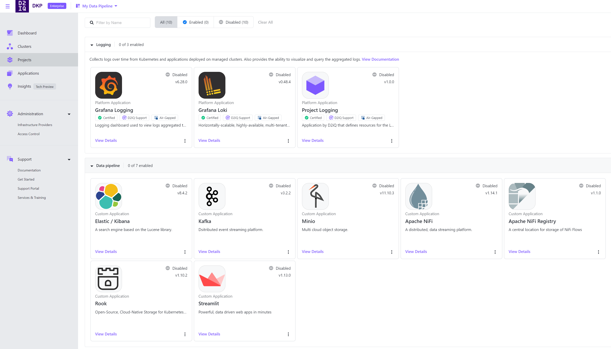</p>

## Deploy our custom applications

1. We are now ready to deploy our custom applications. For the purpose of this demo, we will build out object storage in a data lake provisioned in Ceph storage by the Rook operator. Therefore, for each of the catalogue items except for minio, choose "Enable" from the menu.

2. The operator associated with each of the applications will now deploy. This will take serveral minutes to complete. Check progress by viewing the pods in your project namespace.

    ```bash
    export NS=data-demo  # Use your project namespace
    watch kubectl get po -n $NS
    ```

3. Once all pods are running you are ready to create your deployment. Please note that the "kafka-ui" will likely be in a crash loop backoff status. This is because we have yet to deploy the kafka cluster and can be ignored.

4. The CEPH cluster that we have deployed using the Rook operator will be installed in its own namespace called "rook-ceph". They should take around 5 mins to become healthy. Check the pods in that namespace as follows:

    ```bash
    watch kubectl get po -n rook-ceph
    ```

## Apply our Deployment Objects

1. We have now installed the operators into our kubernetes cluster. These operators allow us to define our deployments through "Custom Resource Definitions". The "deployments" directory in this repo has basic examples of each in order to run the demo. See the table at the top of this document for links to each of the operators. The API documentation for each will allow you to compose more complex manifests to suit your needs when deploying into productions. Here is an example manifest that defines a simple Elastic cluster.

    *Do not apply this manifest; it's just an example!*

    ```yaml
    apiVersion: elasticsearch.k8s.elastic.co/v1
    kind: Elasticsearch
    metadata:
      name: elastic
    spec:
      version: 8.4.2
      http:
        service:
          spec:
            ports:
            - name: http
              nodePort: 30300
              port: 9200
              protocol: TCP
              targetPort: 9200
            type: NodePort   
        tls:
          selfSignedCertificate:
            disabled: true
      nodeSets:
      - name: default
        count: 3
        config:
          node.store.allow_mmap: false
      ```

2. It is advisable to use the "Continuous Deployment (CD)" feature in the DKP interface to manage these deployments. We can either enter these manually or alternatively, we can add them through manifests by running the following:

    ```bash
    kubectl apply -f deployments/github-sources/github-sources.yaml
    ```

3. Check that these sources have been applied and enable them by clicking "Resume" for each in the menu as follows:

<p align="center">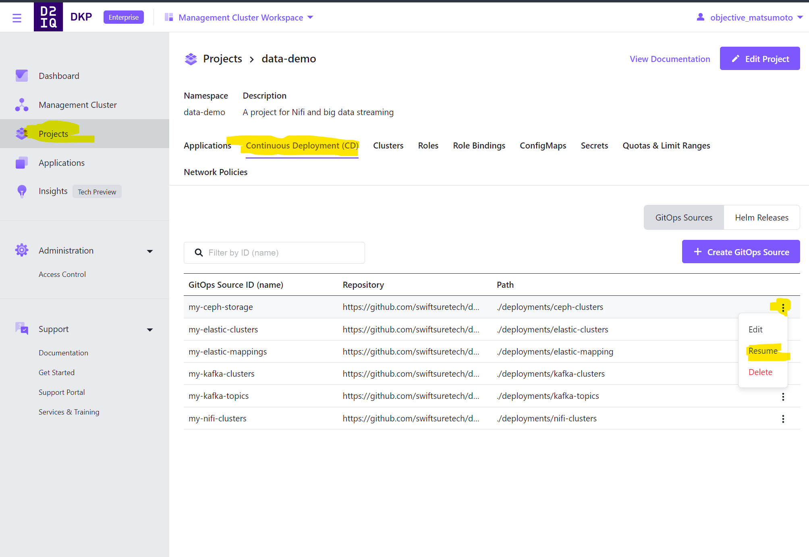</p>

4. Once flux detects these Gitops sources and determines a configuration drift, it will start to deploy these objects which include a NiFi Cluster (with Zookeeper), NiFi Registry, ElasticSearch and Kibana, Kafka (with Zookeeper) and Kowl and Streamlit.

5. This will take up to 10 mins to complete; Observe progress by watching the pods in your project namespace:

    ```bash
    export NS=data-demo  # Use your project namespace
    watch kubectl get po -n $NS
    ```

## Ingress

1. When we deployed the "catalog" helm chart at the start of the demonstration, ingress for each of the UIs associated with the applications was installed using the resident Traefik ingress controller that ships with DKP. For a production use case it is recommended that you deploy a distinct instance of your own ingress controller class and configure accordingly.

2. The following endpoints are instantiated. The base URL for each is the same as the URL used to access the DKP dashboard.

<center>

| User Interface | Endpoint |
|-----|-----|
| DKP | https://my-app.com/dkp/kommander/dashboard/ |
| NiFi | https://my-app.com/nifi/ |
| NiFi Registry | https://my-app.com/nifi-registry/|
| Kibana | https://my-app.com/kibana/ |
| Kowl (Kafka UI) | https://my-app.com/kafka/ |
| Rook Ceph | https://my-app.com/ceph/ |
| Streamlit | https://my-app.com/streamlit/ |

</center>

## Configure NiFi

### Set up a service account and bucket in Ceph

1. Log into the Ceph user interface as the "admin" user. You will first need to recover the generated admin password. This may be found in a secret called "rook-ceph-dashboard-password" in the "rook-ceph namespace". Recover it as follows:

    ```bash
    kubectl get secret -n rook-ceph rook-ceph-dashboard-password --template={{.data.password}} | base64 -d
    ```

2. Generate a service account for NiFi. Ensure that you uncheck "Auto-generate Key" and add your own access key and secret, both set to NiFi for this demo.

<p align="center">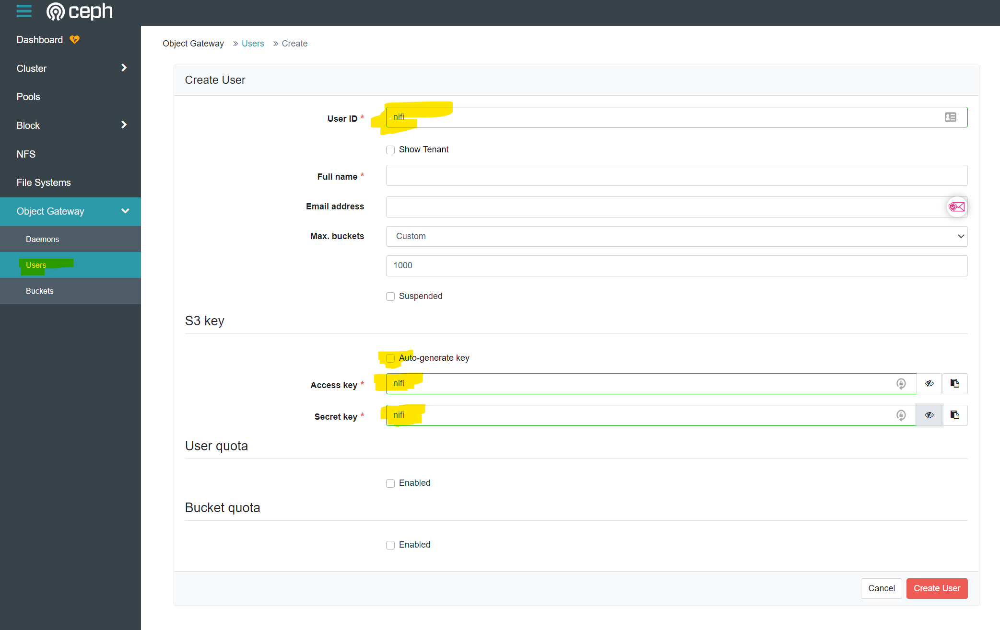</p>

3. Generate a bucket using our newly created service account. Call the bucket "nifi" and select "nifi" as the owner of the bucket.

<p align="center">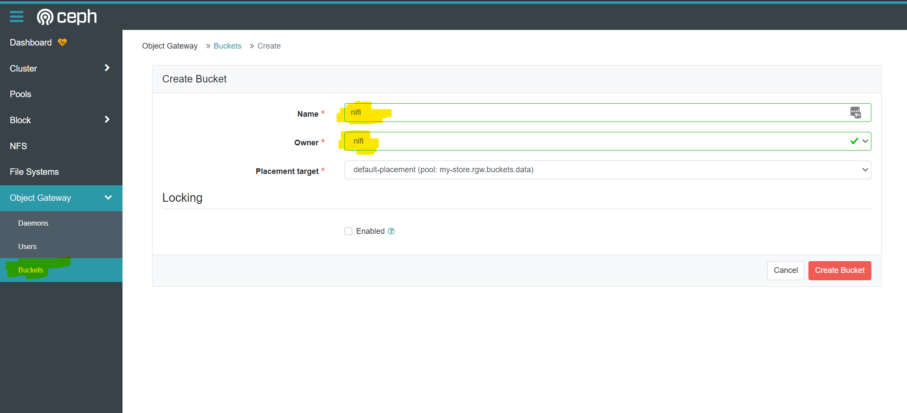</p>

### Import NiFi flow

1. An example flow can be found in this repo in the "nifi-flows" directory. Download that to your local machine.

2. Open the NiFi user interface. There should be a blank canvas. Click on the "Upload Template" button to upload the template you just downloaded from your web browser. The template is an XML file. Once uploaded your will recieve a notification of success.

<p align="center">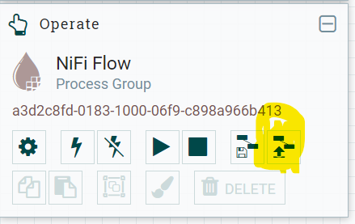</p>

3. We can now deploy that template by selecting the "Template" button from the top menu bar and dragging it onto the canvas. Select the canvas you just uploaded; it's called "test":

<p align="center">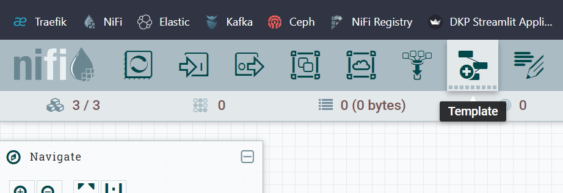</p>

4. Our processor group should appear on the canvas. Double click it to enter the various sub-processor groups. In order to go back up a level, right click the canvas and choose "LEave group". Have a click around inside each of the groups.  Each box is responsible for a dedicated task, ie, getting data from an API or writing to a database. Each of those actions or "Processors" is decoupled from the next by a queueing system for which you can set parameters to manage.

### Update our elastic credentials

1. When we deployed our elastic cluster, we configured the Elastic API to authenticate with a username and password. In this instance, both were set to "elastic" for simplicity. A template cannot store secrets and so, for both of the "Write to Elastic" processors, we need to manually input these credentials.

2. Enter each of the processor groups on the main canvas and locate the relevant Elastic processor.

<p align="center">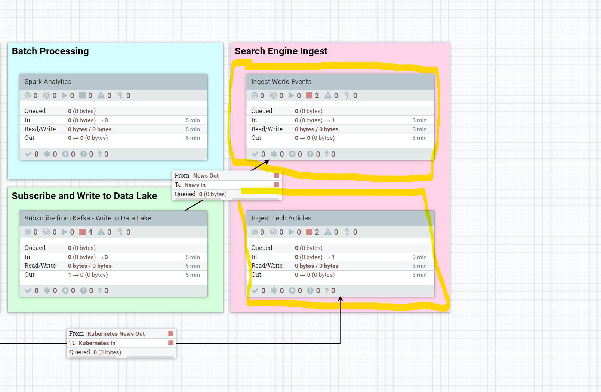</p>

3. Locate the processor called "PutElasticsearchHttp" in both cases, select "Properties", and locate the property called "Password".

4. Enter the value "elastic" and apply.

<p align="center">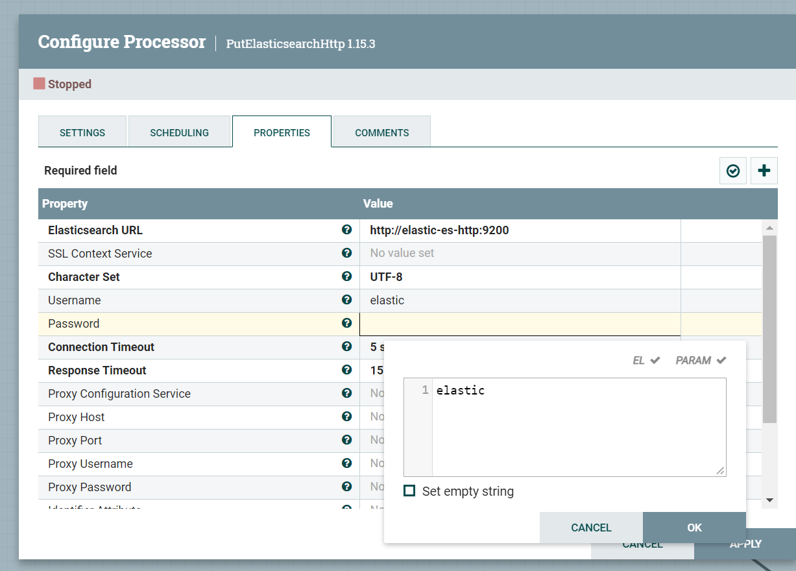</p>

### Set our Ceph Bucket credentials

1. When we set up Ceph in an earlier step, we created a service account called nifi and a bucket called "newsitems". Enter the processor group called "Subscribe from Kafka - Write to Data Lake" and configure the "Write to Data Lake" processor by double clicking it and selecting "Properties".

2. Enter values as follows:
     - "Bucket": newsitems
     - "Access Key ID": nifi
     - "Secret Access Key": nifi

### Enable Controller Services

1. The final step in configuration is enable our "Controller Services".

2. Enter the controller group called "Batch Ingest News Events".

<p align="center">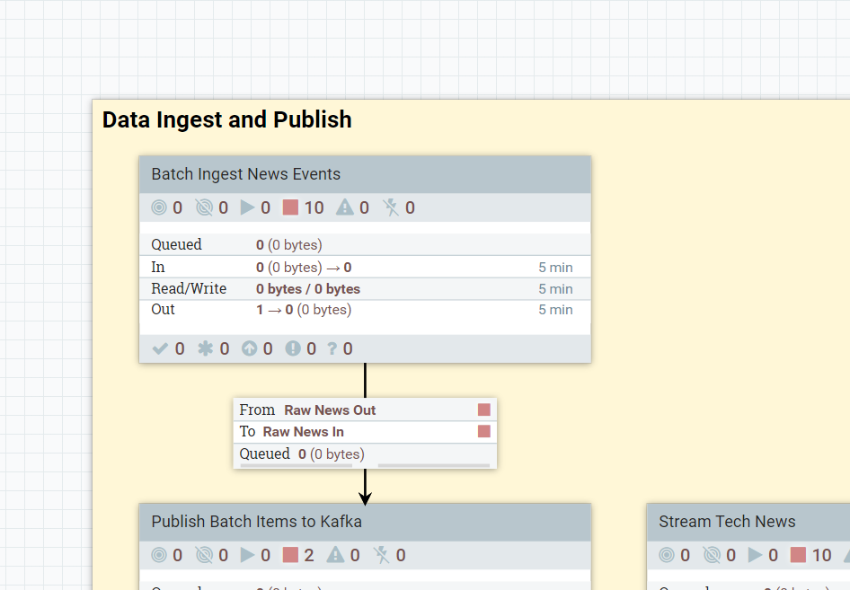</p>

3. Find the controller called "Split into JSON blobs", select properties and click on the arrow icon in the values list:

<p align="center">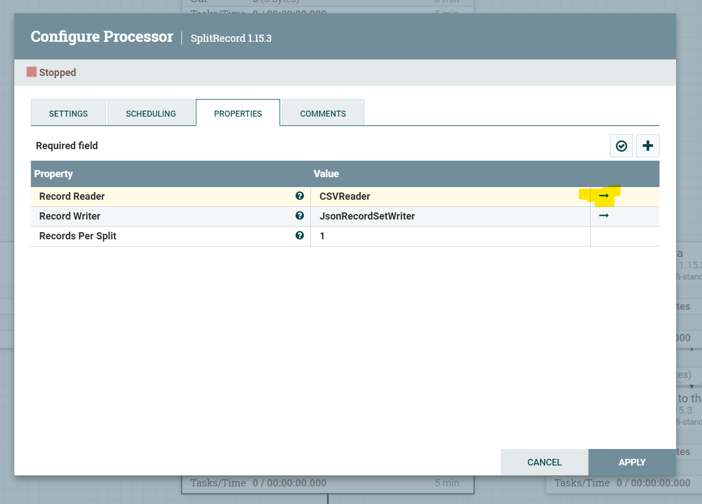</p>

4. For both the controller services listed, click on the enable icon:

<p align="center">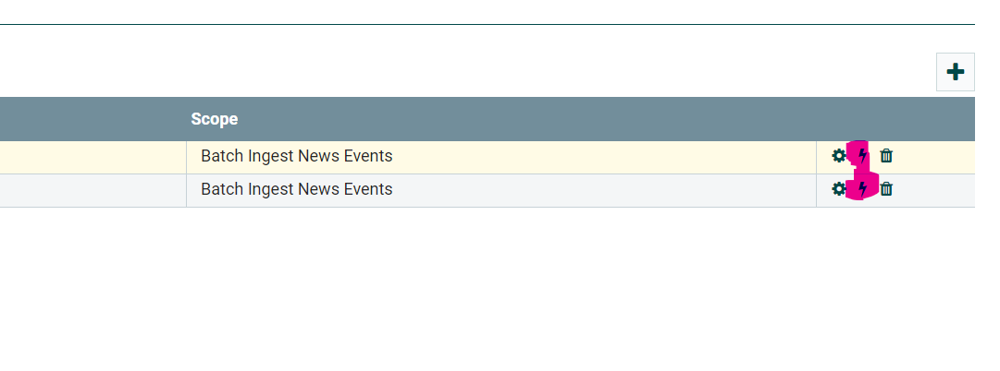</p>

## Run the Data Flows

1. By right clicking either individual processors or processor groups and selecting the "Start" icon we can control our flows.

2. Log back into the Ceph, Kafka and Kibana UIs to observe the flow of data and validate the workflow.

## Run streamlit

1. The streamlit helm chart deploys a simple, sample application that contains some basic instruction of how to set up your front end. Use your own IDE to develop your streamlit application. For the purposes of the demo, one is provided that connects to the Elastic instance to provide some analysis tools and a search box.

2. Streamlit configuration is stored in a configmap called "streamlit-app". Inspect the demo application configuration by running:

    ```bash
    # Set my project namespace here
    export NS=data-demo
    kubectl describe configmap -n $NS streamlit-app
    ```

3. Notice that there are 2 key-value pairs; app and requirements. You may generate this config map in the projects section of the UI by selecting "ConfigMaps" from the menu or simply edit and overwrite the existing config in a terminal. For the demo, navigate to the "streamlit-app" directory and copy the contents of app.py into the app key store and the contents of "requirements.tx" into the requirements store.

4. The streamlit app is controlled by a deployment. For expediency, delete the existing pod. It will then re-spawn, picking up the new configmap.

    ```bash
    export SL=$(kubectl get po -o name | grep streamlit)
    kubectl delete $SL  
    ```
5. Reload the streamlit endpoint and view the application.

<p align="center">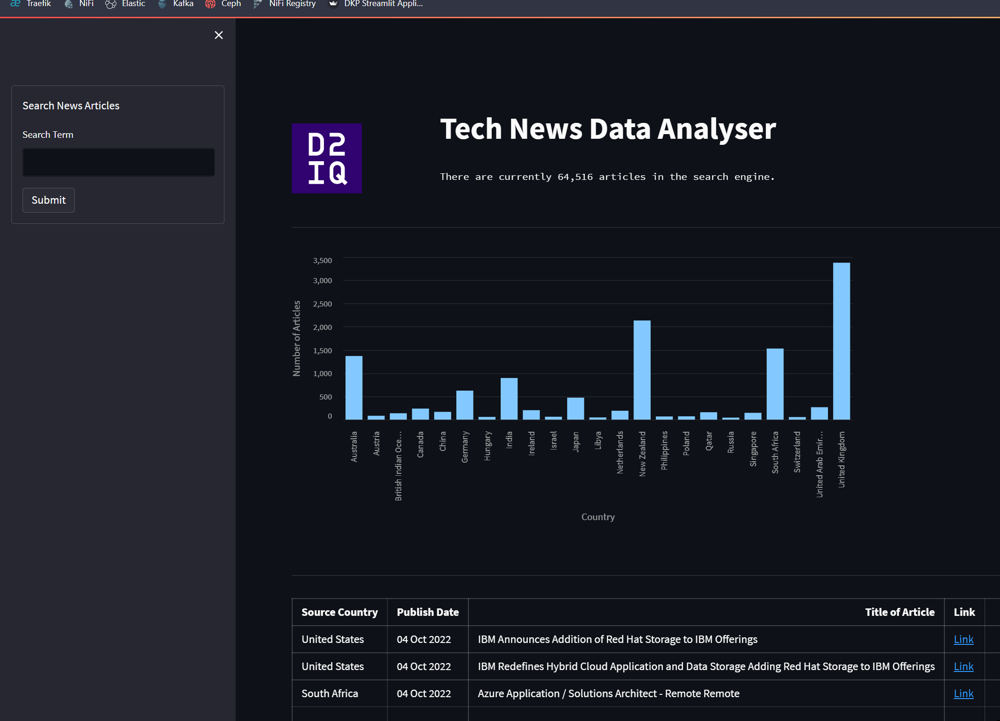</p>